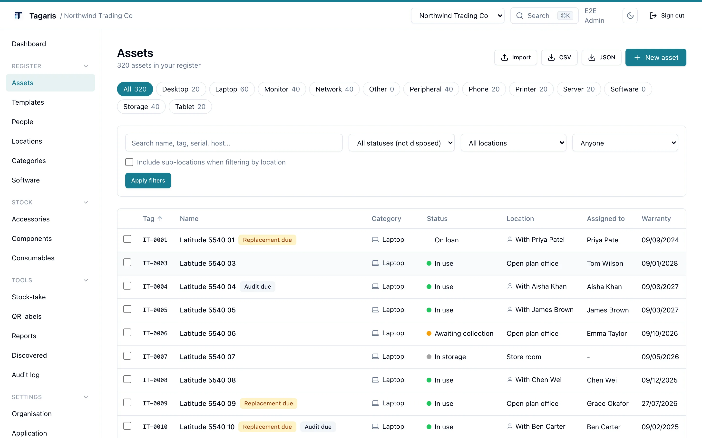

# Tagaris

Self-hosted IT asset register for small IT teams, MSPs and homelabbers. Track hardware, software licences, warranties, stock and assignments, and know where everything is.

Tagaris runs as two containers, the app and PostgreSQL, on a small VPS or a homelab box with about 1 GB of memory. Your data stays on your server: no telemetry, no phone home, and full export at any time.

This repository holds the deployment files: an example compose file and .env for the standard install, plus a single-container variant. Tagaris itself is a commercial product with a free tier and its source code is not published. Images are on [Docker Hub](https://hub.docker.com/r/goodhallsolutions/tagaris).

**Try it without installing**: the demo at [demo.tagaris.co.uk](https://demo.tagaris.co.uk) is a full instance with a realistic dataset. Sign in with the credentials shown on the login page; the data resets nightly.



## Quick start

```sh
mkdir tagaris && cd tagaris
curl -o docker-compose.yml https://raw.githubusercontent.com/goodhall-solutions-ltd/tagaris/main/example-docker-compose.yml
curl -o .env https://raw.githubusercontent.com/goodhall-solutions-ltd/tagaris/main/example.env
# Edit .env: set the database password, the auth secret and the public URL.
docker compose up -d
```

Open `http://your-host:3000`. The first visit opens the setup wizard, which creates your organisation and the first administrator account. Database migrations run automatically at start.

Two settings deserve care:

- `BETTER_AUTH_SECRET`: generate a strong value with `openssl rand -base64 32`.
- `BETTER_AUTH_URL`: the address people actually reach the app on, not localhost. QR labels, invite links and sign-in depend on it.

The full guide, including reverse proxy, storage and upgrades, is at [docs.tagaris.co.uk/self-hosting](https://docs.tagaris.co.uk/self-hosting).

### Single container

[example-docker-compose-bundled.yml](example-docker-compose-bundled.yml) runs the same app with PostgreSQL inside the one container, good for Unraid and other single-machine setups. See the [self-contained install guide](https://docs.tagaris.co.uk/self-host-bundled). Pointing Tagaris at a PostgreSQL server you already manage is covered in the [dedicated-database guide](https://docs.tagaris.co.uk/self-host-external).

## What it does

- Hardware, software licences, domains, warranties and assignments in one place, with a dated history on every asset
- Check-out and check-in to people and multi-level locations (site, floor, room, rack)
- Accessories, components and consumables with low-stock alerts
- Photos and attachments (receipts, invoices, manuals) on assets
- Printable QR label sheets for assets and locations; scan a door, audit a room
- CSV import with Snipe-IT and Halo presets, and full export to CSV or JSON at any time
- Built-in reports with CSV export and print, plus a custom report builder
- A daily email digest of renewals due, warranty expiries and low stock
- Serial number intelligence: Dell, Lenovo and Apple formats recognised, with links to the maker's warranty lookup
- Scheduled encrypted backups with restore, including S3-compatible offsite
- Two-factor authentication; email by SMTP, Microsoft 365 or Google Workspace
- A documented REST API (v1) with personal and organisation keys

Team features for organisations that need them: multiple users with Admin, Editor and Viewer roles, Microsoft single sign-on, an org-wide audit log and scheduled email reports. Device sync from Microsoft Intune and Jamf Pro is a free beta.

## Free and paid

The free tier is the full register for a single administrator: no asset limit, no export limit, no trial clock. A Team licence (5, 10, 25 or 50 people) adds the team features above. Keys arrive by email within minutes of checkout, activate once, and are then verified offline on your own server; air-gapped installs use a licence file with no internet at all. Pricing is at [tagaris.co.uk](https://tagaris.co.uk).

## Updating

Pull a newer image and start the stack again; migrations run automatically.

```sh
docker compose pull && docker compose up -d
```

The `latest` tag tracks the current release. For anything beyond a trial, pin a major version such as `goodhallsolutions/tagaris:2`. See [Upgrading](https://docs.tagaris.co.uk/upgrading).

## Issues and support

Bug reports and feature requests are welcome in [issues](https://github.com/goodhall-solutions-ltd/tagaris/issues). For questions, start with the [documentation](https://docs.tagaris.co.uk) or email contact@goodhallsolutions.co.uk. For security reports see [SECURITY.md](SECURITY.md); please do not open a public issue for a vulnerability.

## Links

- Website and pricing: https://tagaris.co.uk
- Live demo: https://demo.tagaris.co.uk
- Documentation: https://docs.tagaris.co.uk
- Docker Hub Standard: https://hub.docker.com/r/goodhallsolutions/tagaris
- Docker Hub Bundled: https://hub.docker.com/r/goodhallsolutions/tagaris-bundled
## Licence

The deployment files in this repository may be freely copied and adapted. The Tagaris application is proprietary software from Goodhall Solutions; the free tier is licensed for use at no charge, and paid tiers add the team features. See [LICENSE](LICENSE) and the full terms at https://tagaris.co.uk/terms.html.
